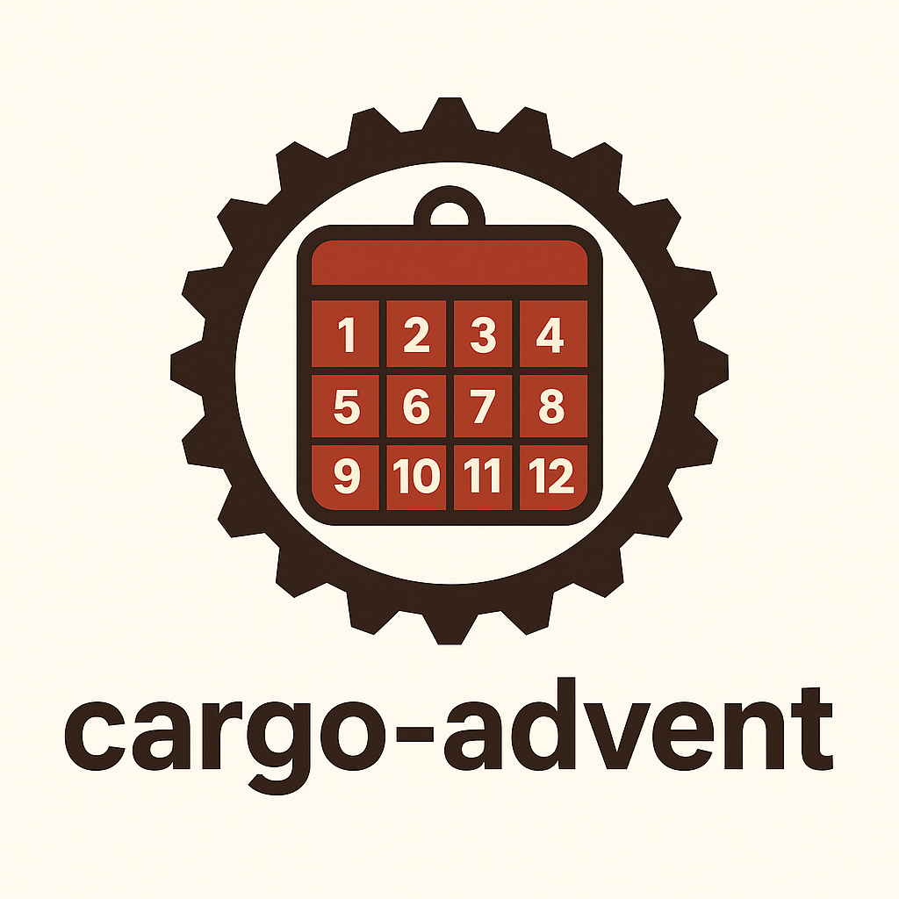

<div style="text-align: center;">

# cargo-advent



> A command line utility (yes yet another) for Rust Advent of Code projects

</div>

This cli will (eventually):

| feature                                                                                                 |                                                  Outstanding Issues                                                   | Implemeted Version |
|---------------------------------------------------------------------------------------------------------|:---------------------------------------------------------------------------------------------------------------------:|:------------------:|
| Generate a scaffolded git repository, similar to cargo init that templates the year/day for the problem |                               https://github.com/codersparks-aoc/cargo-advent/issues/7                                |       0.1.0        |
| Allow user to download input files to the repo to allow testing                                         | https://github.com/codersparks-aoc/cargo-advent/issues/8<br>https://github.com/codersparks-aoc/cargo-advent/issues/10 |        N/A         |
| Submit output for solution to the AOC website                                                           |                               https://github.com/codersparks-aoc/cargo-advent/issues/9                                |        N/A         |
| Benchmark the solutions                                                                                 |                               https://github.com/codersparks-aoc/cargo-advent/issues/11                               |        N/A         |

## Usage

The application uses subcommands to run different actions. as described below. Each subcommand has its own help
available by running `cargo-advent <subcommand> --help`. All command line arguments/options are configurable via
environment variables. The relevant --help output lists the environment variables that can be set.

For example, the output for `cargo-advent generate --help is:`

```text
Generate a rust project using the configuration supplied

Usage: cargo-advent.exe generate [OPTIONS]

Options:
  -n, --project-name <PROJECT_NAME>  The name to use for the generated project. If not supplied will use name aoc-{aoc_year}-{aoc_day} [env: ADVENT_PROJECT_NAME=]
  -t, --template <TEMPLATE>          The source of the template [env: ADVENT_TEMPLATE_URL=] [default: https://github.com/codersparks-aoc/aoc-rust-template.git]
  -b, --base-url <BASE_URL>          The base url for the aoc website [env: ADVENT_BASE_URL=]
  -y, --year <YEAR>                  The year the aoc puzzle was published. If not supplied will use current year [env: ADVENT_YEAR=]
  -d, --day <DAY>                    The day the aoc puzzle was published. If not supplied will use current day [env: ADVENT_DAY=]
  -p, --path <PATH>                  The path to use for where to create the project. Default ./{project_name} [env: ADVENT_PROJECT_PATH=]
  -h, --help                         Print help
```

The setting for `-n`/`--project-name` can be set via the environment variable `ADVENT_PROJECT_NAME`. If there is a .env
file in the current directory, it will be read and the environment variables will be available to the application. This
expects that the variabless are in the format `<env_var>=<value>` with each variable on a new line for example the
following would set the `-n`/`--project-name` and `-p`/`--path` parameters:

```text
ADVENT_PROJECT_NAME=my-project-name
ADVENT_PROJECT_PATH=./my-project-path
```

The variables loaded from the .env file can be seen in the help output for the relevent subcommand. For example if the
above example was used for the `generate` subcommand, the help output would be:

```text
...
  -p, --path <PATH>                  The path to use for where to create the project. Default ./{project_name} [env: ADVENT_PROJECT_PATH=./my-project-path]
...
```